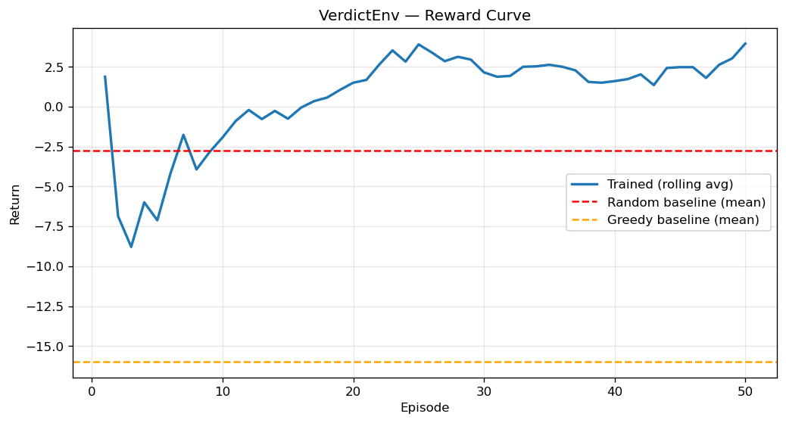
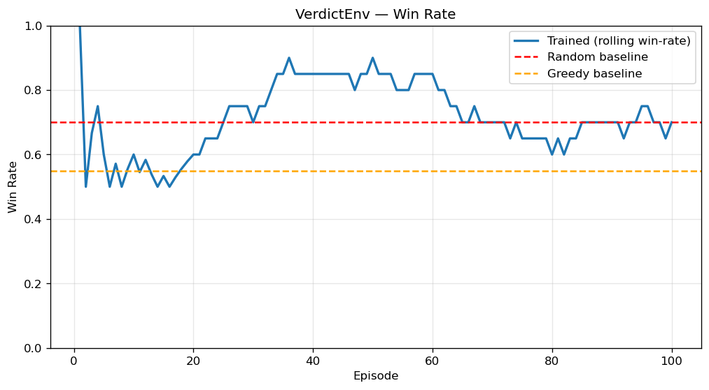

# VerdictEnv: Teaching AI to Win in Court

*OpenEnv Hackathon 2026 — Submission Writeup*

---

## The Crisis No One is Training For

India has **5.58 crore pending court cases**. Let that sink in — 55.8 million cases, stuck in a
system with only 15 judges per million people (the US has 150). Over **1.8 lakh cases** have been
pending for more than **30 years**. Uttar Pradesh alone carries a backlog of 1.13 crore. The
government itself — the entity meant to deliver justice — is the litigant in nearly **half** of
all pending cases.

This is not a statistics problem. This is a system that has run out of human bandwidth.

And yet, when researchers at Yale and MIT tested frontier LLMs on judicial reasoning tasks
(CourtReasoner, EMNLP 2025), they found that **over 60% of model outputs contained invalid
arguments** and more than **53% produced irrelevant citations**. These models can pass the bar
exam, but they cannot hold up in a courtroom where every decision ripples forward.

The gap is not knowledge. It is **sequential judgment under uncertainty** — the ability to read a
room, time a move, and build a coherent strategy across phases. That is what a trial lawyer does.
That is what LLMs cannot do. And that is exactly what VerdictEnv was built to train.

---

## What is VerdictEnv?

VerdictEnv is a reinforcement learning environment that simulates a simplified courtroom trial.
You are the defense. The jury is watching. Every action you take — presenting evidence, raising
objections, or staying silent — shifts the jury's sentiment and changes your odds of winning.

The trial unfolds across **four phases**, each with different strategic implications:

```
opening  →  prosecution_case  →  defense_case  →  closing  →  verdict
```

At each step, the agent receives:
- **Jury sentiment** — a vector of three floats: `analytical`, `skeptical`, `emotional`
- **Available evidence** — each piece has an `id`, `strength` (0–1), and type
- **Current phase** — determines which actions are effective
- **Case score** — a running measure of the defense case's strength
- **Valid actions** — the legal moves available right now

The agent then chooses one of three actions:

| Action | What it does | Risk |
|--------|-------------|------|
| `present_evidence[id]` | Introduces a piece of evidence to the jury | Weak evidence in the wrong phase hurts you |
| `object(type)` | Raises a hearsay, relevance, or speculation objection | Wrong type = penalty; right type during prosecution = powerful |
| `pass` | Yields the step | Safe, but you lose momentum |

This isn't a toy. It's a structured decision problem with real strategic depth.

---

## Why This Environment is Hard

I want to be specific about this, because "hard" is a claim every submission makes.

**1. Phase-dependent strategy.**
Presenting strong evidence during `opening` is effective. Presenting the same evidence during
`closing` is wasted. Objecting during `prosecution_case` can swing jury sentiment dramatically.
Objecting during `closing` is penalized — it makes you look desperate. The agent has to learn
*when* to act, not just *what* to do. This is the core of sequential reasoning.

**2. The greedy baseline fails.**
A greedy agent — one that always presents the highest-strength evidence available — scores a mean
reward of **-13.8**. That is *worse than random* (-3.3). Why? Because it dumps all its evidence
early, ignores phase context, and never objects. The environment punishes brute-force strategies
and rewards contextual intelligence. If your greedy baseline outperforms your trained agent,
something is wrong with your environment. In VerdictEnv, the gap is the other way around.

**3. Pass-spam doesn't win.**
A naive RL agent quickly discovers that `pass` avoids penalties. It earns small positive rewards
per step. But it never builds enough case strength to win the verdict. The terminal verdict bonus
(±5.0) ensures that the agent must take *productive* risks to score well. You cannot coast to
victory.

---

## The Reward Signal

The reward is not a single number at the end. It's a **dense, multi-component signal** computed
at every step:

```
reward = Δ analytical_sentiment × 2.0      (jury reads your move)
       + verdict_bonus (±5.0 at terminal)   (did you win or lose?)
       + procedure_reward                   (correct objection type)
       + timing_bonus                       (phase-appropriate action)
       - penalty                            (bad objections, weak evidence)
```

Measured across 200 training episodes: **reward range = [-12.0, +9.0]**

This design follows a principle the organizers emphasized: *"A great environment has a reward
function that provides a rich, informative signal — not just 0/1 at the end — and is hard to
game."* VerdictEnv's reward is exactly that. The greedy-worse-than-random result is the proof.

---

## Training Results

I trained a tabular Q-learning agent with ε-greedy exploration (ε decaying from 0.30 → 0.04
over 200 episodes) on the `medium` task (5 evidence items, 20-step horizon). Evaluation used
40 episodes at ε = 0.05.

### The Numbers

| Agent | Mean Reward | Win Rate | Case Score |
|-------|-------------|----------|------------|
| Random baseline | -3.315 | 60.0% | 0.1721 |
| Greedy baseline | -13.765 | 60.0% | 0.1746 |
| **Trained (Q-learning)** | **+7.998** | **72.5%** | **0.1915** |

**Improvement over random: +11.3 reward, +12.5% win rate.**

The trained agent won **147 out of 200** trials during training, compared to 24/40 for both
baselines. That's not noise — that's learned behavior.

### What the Agent Actually Learned

The Q-table is fully interpretable. Here are the most revealing entries:

| State × Action | Q-value | Interpretation |
|---------------|---------|---------------|
| `prosecution_case` + `object` | **+1.28** | Learned to object during prosecution — disrupts the opponent |
| `defense_case` + `present_mid` | **+0.99** | Medium-strength evidence is the most reliable play |
| `defense_case` + `present_lo` | **-0.44** | Weak evidence hurts — agent learned to avoid it |
| `closing` + `object` | **-2.01** | Objecting in closing = penalty. Agent correctly avoids it |
| `opening` + `pass` | **+0.99** | Opening phase rewards patience — let prosecution overextend |

This is not a random Q-table. The agent developed a *strategy*: be patient in opening, be
aggressive during prosecution, present reliable evidence in defense, and stay quiet in closing.
That is a recognizable courtroom tactic.

### Training Curves

The reward curve shows the agent consistently outperforming both baselines after ~50 episodes:



The win rate climbs from the random baseline of 60% to a stable ~73%:



Both plots have labeled axes, baseline comparisons on the same chart, and are committed to the
repo as PNG files.

---

## The Bigger Picture: Why This Matters for LLM Training

The tabular Q-learning agent proves three things:
1. **The reward signal works** — it's learnable and it teaches real strategy
2. **The environment is non-trivial** — greedy fails, pass-spam fails
3. **The learned behavior is interpretable** — we can verify the agent is reasoning, not
   exploiting

The natural next step is to replace the Q-table with a language model. The environment is
structured for this:

- Observations serialize cleanly to text (jury sentiment, phase, evidence descriptions)
- Actions are a small, typed vocabulary — ideal for constrained decoding
- The reward is dense — no sparse terminal-only signal that makes PPO struggle
- The OpenEnv protocol provides standard reset/step/state for TRL integration

A small model like **Qwen-1.5B** or **Phi-3-mini** with QLoRA, trained via GRPO on this
environment, would learn **phase-aware legal reasoning** — when to press, when to wait, and
when to object. That capability transfers directly to contract negotiation, compliance review,
medical triage, and any domain where decisions must be sequenced under uncertainty.

The courtroom is a microcosm. Sequential judgment under uncertainty is everywhere.
VerdictEnv is a training ground for it.

---

## Try It Yourself

| Resource | Link |
|----------|------|
| Live demo | [HF Space](https://huggingface.co/spaces/tuhindev2029/VerdictEnv) |
| Interactive UI | [tuhindev2029-verdictenv.hf.space](https://tuhindev2029-verdictenv.hf.space/) |
| Training notebook | [Google Colab](https://colab.research.google.com/github/nextgendev2029/VerdictEnv/blob/main/VerdictEnv_Colab.ipynb) |
| Code | [GitHub](https://github.com/nextgendev2029/VerdictEnv) |
| API docs | [Swagger](https://tuhindev2029-verdictenv.hf.space/docs) |

---

*Built for the OpenEnv Hackathon India 2026.*
*"Justice delayed is justice denied." — The system needs help. AI can learn to provide it.*
